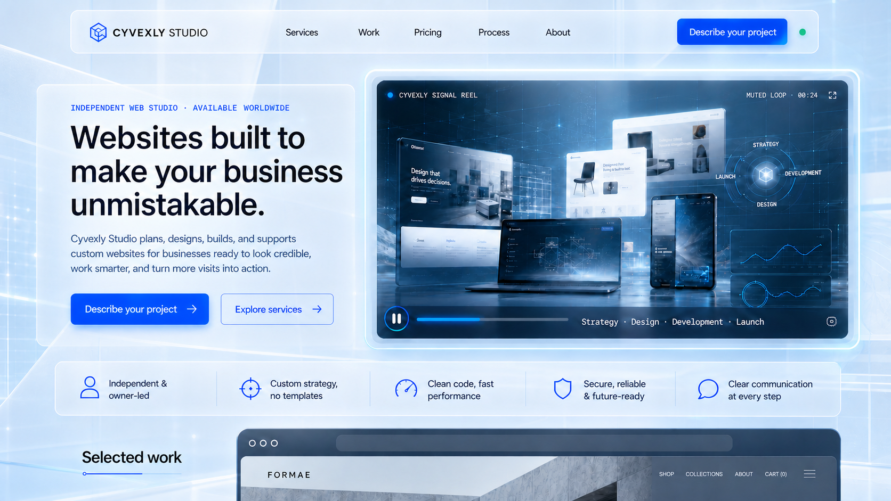
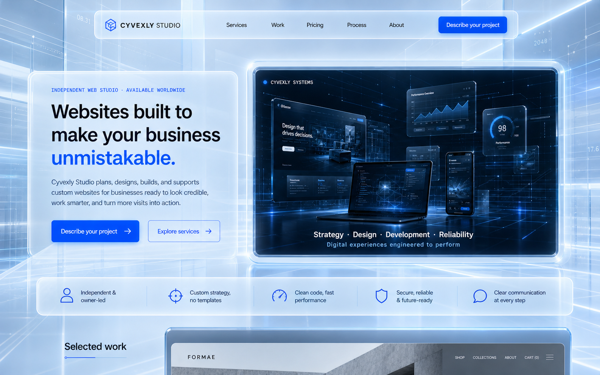

# Cyvexly Owner Direction

## Active direction 2026-08-30-01

**Status:** FULFILLED BY ENVIRONMENT SETUP  
**Source:** Owner via Codex side conversation  
**Recorded:** 2026-08-30 America/New_York

> “bring these files into this folder so that we can set up the environment for the agents to perform each role in this folder (website folder) so we can run these roles in this folder and on this project. once these files are in place then set up the evironments of each role according to the rules inside those files”

## Approval 2026-08-30-02

**Status:** ACTIVE AUTHORIZATION  
**Source:** Owner via Codex side conversation  
**Recorded:** 2026-08-30 America/New_York

> “yes but i looked over them and approve.”

Agent interpretation: The Owner approved coordinated project-scoped activation of the four supplied packets. This interpretation is not Owner-authored wording.

## Scheduler boundary 2026-08-30-03

**Status:** ACTIVE
**Source:** Owner via Codex side conversation  
**Recorded:** 2026-08-30 America/New_York

> “yes just set up teh environment not the schedulars”

Do not create, configure, enable, or modify recurring role schedulers or automations unless later authenticated Owner direction explicitly authorizes them and provides the needed cadence/metadata.

## Visual fidelity direction 2026-08-30-04

**Status:** PARTIALLY FULFILLED — ROUND 18 PRICING SCOPE-SYSTEM PASS; OWNER REVIEW PENDING
**Source:** Owner via Codex side conversation
**Recorded:** 2026-08-30 America/New_York

> “i've noticed the mockup and the actual are close but not. the glassy futuristic look is still not on par with the mockup. ptu that in owners direction.”

The current implementation is not yet accepted as visually on par with the mockup. Continue refining the product's glassy, futuristic visual treatment toward the mockup's standard while preserving usability, accessibility, responsiveness, and truthful product representation.

Round 9 upgraded the shared glass primitive, signal-grid atmosphere, sticky header, primary CTA, and hero orbit, with rendered desktop/mobile comparison against the accepted Home mockup. This is meaningful forward fidelity work, not a claim of Owner acceptance or final parity; keep the direction active until the Owner evaluates the result.

Round 10 changed method from another token-only adjustment to a reference-driven
component-structure pass. It shipped an inset rounded glass header shell, an
icon-led five-claim credibility rail, and icon-bearing capability cards, all
verified in opened 1440/768/390 production renders and a native keyboard/menu
check. The result closes three visible structural gaps against
`mockups/01-home.png`; it still does not claim Owner acceptance or final parity.

Round 11 replaces the remaining static hero orbit with the Owner-supplied
30-second systems showcase as a muted, looping, poster-backed glass media panel.
Opened 1440/768/390 production renders confirm the new motion increases the
hero's luminous technology/art-direction density while retaining the bright
page, message hierarchy, responsive containment, reduced-motion behavior, and
truthful claims. This is an implementation of the Owner's supplied media and
active fidelity direction, not a claim of final visual acceptance.

Round 12 closes two more visible structural gaps against `mockups/01-home.png`:
the formerly text-only partner statement now has an original luminous
wireframe system diagram, and the formerly text-only five-stage Home process
now has a connected desktop signal route with distinct stage icons plus
contained tablet/phone cards. Opened exact 1440/768/390 production renders and
a 24px-root phone stress state remain width-contained. The work advances the
active direction without copying the reference literally or claiming final
Owner acceptance.

Round 13 closes the next reachable reference-visible gap: the former flat,
centered final CTA is now a compact split glass composition with an original
luminous planetary/network horizon, brighter protected copy, and a responsive
centered phone adaptation. Exact 1440/768/390 and full-Home renders plus 320px
and 24px-root stress checks are contained. This is forward fidelity work, not a
claim of final Owner acceptance; portfolio imagery remains bounded by truthful
asset provenance.

Round 18 applies the same reference-driven method to Pricing rather than
repeating another Home/Services token adjustment. The former centered
text-only entry is now a split pale-blue glass composition with an original
five-package scope signal, and the unchanged package cards share a luminous
constellation field. Opened local/public 1440/768/390 renders, a complete
five-card composition, 1023/1024/320 boundaries, and a 24px-root phone stress
state are contained. This materially advances the approved Pricing mockup's
orbital/glass hierarchy without changing package facts or claiming Owner
acceptance.

## Cross-device view consistency direction 2026-08-30-05

**Status:** IMPLEMENTED — OWNER DEVICE CONFIRMATION PENDING
**Source:** Owner via Codex side conversation
**Recorded:** 2026-08-30 America/New_York

> “is there some issue with different views? i logged into the website on one view and it looked normal. i logged into another computer (there was no zoom) and it looked like it is a zoomed in view. put this in owners direction to fix as well.”

Investigate and fix the observed cross-computer scale inconsistency. The site must remain visually proportionate and intentional across supported desktop and laptop environments when browser zoom is 100%, rather than appearing unexpectedly zoomed in on one machine. Verify the same routes across representative effective viewport sizes, device-pixel ratios, and operating-system display-scaling settings; treat those factors as hypotheses to test rather than an assumed cause. Preserve responsive behavior and accessibility, including legitimate user zoom.

Owner-provided visual evidence: `Screenshot 2026-08-30 200831.png` and `Screenshot 2026-08-30 200855.png`.

Round 9 reproduced a concrete 100%-page-zoom cause: the design system inherited a browser profile's non-default 24px base font size through rem-based tokens and responsive breakpoints, enlarging the entire interface and changing its desktop/mobile mode. Commit `8ec27c1` pins the author design root at 16px and defines responsive breakpoints in CSS pixels. In controlled Chrome and Edge profiles, the normal-default and 24px-default profiles now produce matching geometry and responsive states across desktop, high-DPR laptop, and phone viewports. A separate minimum-font-24 audit found and commit `2d82b0b` fixed two phone overflow cases. The actual second computer still needs Owner confirmation because its browser/OS configuration was not directly inspected.

## Live Home video direction 2026-08-31-06

**Status:** FULFILLED — ROUND 15 PUBLIC DEPLOYMENT PROOF
**Source:** Owner via Codex active conversation
**Recorded:** 2026-08-31 America/New_York

> “it still didn't show up on the website... the video”

Round 15 traced the discrepancy to source/deployment identity rather than the
video component: GitHub/Render were still serving repository default branch
`main` at pre-video commit `c13ae7a`, while the accepted Builder history had
been pushed only to `master` at `57480e3`. Because `main` had zero independent
commits and was a strict ancestor, the Builder fast-forwarded it without force,
then renamed the local branch to track `origin/main` so ordinary future pushes
reach the deployment branch. The public Render site changed within about 51
seconds and now visibly serves the 30-second showcase at desktop and phone
widths. Public MIME/range delivery, real playback, Pause/Play, loop boundary,
reduced-motion/data-saver holds, explicit recovery, responsive containment,
route smoke, console, lint, build, and TypeScript all pass. Durable proof is
indexed in `builder/evidence/INDEX.md`. No scheduler or automation was touched.

## Home hero video scale and placement direction 2026-08-31-07

**Status:** IMPLEMENTED — ROUND 16 PUBLIC DEPLOYMENT/OWNER REVIEW PENDING
**Source:** Owner via Codex side conversation
**Recorded:** 2026-08-31 America/New_York

> “I like your version better and the size . add the mockup and your ur description. the video in the actual looks like a thumbnail and not like what you have. add all this to owners direction”

Follow-up material and contrast direction from the Owner:

> “also there is a translucent background of some kind that you have. we need something like that to give a futuristic glassy blue look.”

> “yes but it looks like that messes with the contrast a bit. so maybe lighter? grayish?”

> “ok sorry maybe just ligher blue than the first”

> “yeah that works. ok add that as the mockup and remove the other one you have in place. explain in words my wishes in owners direction”

The live Home video currently reads too much like a thumbnail. Replace that
small-media impression with the larger, integrated hero-reel treatment shown
in the Owner reference below. This direction concerns the video composition,
scale, hierarchy, and surrounding glass treatment; it does not authorize
copying image-generation text artifacts, invented interfaces, brands, claims,
scores, or metrics into production.

Durable visual reference:
`mockups/05-home-hero-video-owner-direction.png`.

This file now contains the Owner-approved lighter-blue version. It replaces the
earlier reference at the same path; the earlier, more neutral mockup is not an
alternative direction and must not be treated as co-equal guidance.

Implementation direction:

- Place the video in the Home hero's primary visual/media position beside the
  headline and actions, rather than in a separate strip above the navigation or
  as a small card that resembles a thumbnail.
- On desktop, give the video approximately 46–50% of the hero width in a
  substantial 16:9 smoke-glass player. Its height and presence should visually
  balance the full message-and-actions column.
- Preserve the headline, supporting message, and unmistakable primary CTA in
  the left column. The video must demonstrate capability without competing
  with or covering that first-minute information.
- Integrate the player into the arctic cyber-blue hero atmosphere with a crisp
  frosted edge, restrained depth, and spectral glow. It should feel like a
  premium Cyvexly studio reel, not a banner advertisement or generic embedded
  player.
- Give the Home hero a clearly visible translucent futuristic-glass background,
  not merely a flat blue gradient. Use overlapping frosted panes, believable
  backdrop blur and refraction, soft depth, thin illuminated edges, fine grids,
  and restrained signal traces so the page feels dimensional and technologically
  advanced.
- The accepted background color is light ice blue: visibly bluer than neutral
  pearl gray, but appreciably lighter and less saturated than the first blue
  exploration. Do not wash the full copy area in saturated royal blue or cyan,
  and do not reduce the result to an almost colorless gray treatment.
- Protect reading contrast with a quiet translucent blue-white glass field
  behind the headline, supporting copy, and actions. Background lines and
  refractions beneath that field should be faint and softly blurred; headline
  text remains near-black midnight slate and body text remains dark graphite.
- Concentrate the strongest cyber blue in the primary CTA, thin glass edges,
  small signal accents, and the video rim/glow. Navigation and the credibility
  rail may reveal the pale-blue atmosphere through frosted glass, but their text
  and controls must remain immediately readable.
- Retain an intentional poster frame plus a clear Pause/Play control. If the
  reel autoplays, it must be muted, inline, and looping; never autoplay audible
  media.
- For reduced-motion or playback failure, hold the designed poster frame while
  keeping the page message and actions complete without motion. If spoken or
  meaning-carrying audio is later introduced, provide captions and a transcript.
- On mobile, stack the video at full available content width immediately below
  the hero actions and above the credibility strip. It should remain prominent
  while avoiding horizontal overflow or excessive first-screen displacement.
- Keep the credibility strip directly after the hero and let Selected Work
  remain the next major proof section.

The reference was created from the written Cyvexly vision rather than from the
current website or earlier mockups. Its intended hierarchy is: compact glass
navigation; outcome-led copy and CTAs on the left; a large playable studio reel
on the right; then credibility and Selected Work. Small generated lettering in
the image is non-authoritative; canonical product copy and truthful content
requirements continue to govern implementation.

Round 16 implements this direction in product commit `14e12d4`: the Home-only
stage expands to approximately 1440px, the desktop reel grows from 528px to
726.56px in the measured 1440 viewport, the copy receives its own quiet
translucent field, and the player receives a light-ice-blue glass bezel plus
real playback progress. Exact desktop/tablet/phone renders, breakpoint
geometry, playback/loop/Pause/Play, reduced-motion, semantics, containment,
console, route, lint, build, and TypeScript proof are indexed in
`builder/evidence/INDEX.md`. The accepted real video remains unchanged; no
invented mockup screens or generated claims were copied. The implementation is
awaiting Owner review on the public site.

## Home showcase playback-chrome direction 2026-08-31-08

**Status:** FULFILLED — ROUND 20 PUBLIC DEPLOYMENT PROOF
**Source:** Owner via Codex active conversation
**Recorded:** 2026-08-31 America/New_York

> “the video has shows muted video in the top right corner. and there is a play bar that keeps going. and the paly and stop button needs to be removed it can be slower too.”

This newer direction supersedes the Round 16 requirement for a visible
Pause/Play control and progress treatment on the current Home showcase. Remove
the top-right muted/duration pill, advancing progress line, and circular
playback control. Retain the clean media bezel, studio identifier, capability
caption, muted inline loop, poster, and reduced-motion/data-saving holds. Slow
the authored playback rate to `0.75×` (a 30-second source cycle takes about 40
seconds). The complete reel surface remains a named click/keyboard pause target
so the playback chrome disappears without discarding the site's motion and
keyboard accessibility commitments.

## Site-wide blue-glass atmosphere and contrast direction 2026-08-31-09

**Status:** ACTIVE — OWNER-APPROVED MOCKUP; IMPLEMENTATION PENDING
**Source:** Owner via Codex active conversation
**Recorded:** 2026-08-31 America/New_York

> “the actual and the last mockup don't match there needs to b that bluish glass background that is int he mockup. on every page. if you want translucent wires and numbers like futuristic tech as well. give me a mockup first so I know we are on the same page”

After reviewing the new mockup, the Owner approved it with this additional
requirement:

> “yes just like that but make sure the words don't lose contrast or there are no contrast issues. make this owners direction and explain clearly the goal.”

### Goal

Bring the entire production website—not only the Home hero or its video—into
the visual world shown in the approved reference below. Every public page
should feel like part of one pale ice-blue, translucent-glass environment. The
effect must be visibly dimensional and futuristic while all words, controls,
forms, and essential information remain immediately legible. Visual atmosphere
never outranks contrast or usability.

Durable visual reference:
`mockups/06-sitewide-blue-glass-owner-direction.png`.

### Authoritative visual direction

- Treat the page background itself as part of the glass system. It should be a
  clearly blue-tinted, luminous environment with layered translucent planes,
  restrained refraction and blur, thin illuminated edges, soft spectral
  shadows, and believable depth. Do not limit the effect to isolated cards over
  a flat or nearly white background.
- Carry this visual language across every route and major section: navigation,
  page introductions, content surfaces, cards, proof sections, forms, calls to
  action, and footers. Adapt its intensity to the content instead of copying the
  Home composition literally onto every page.
- Translucent signal wires, circuit-like traces, coordinate ticks, and sparse
  futuristic numerals may appear as a low-opacity atmospheric layer. They are
  decorative only: they must not imply real metrics, system readings, customer
  results, or other factual claims.
- Keep the atmosphere refined and architectural. Avoid a gaming, hacker, crypto,
  science-fiction HUD, or generic dashboard appearance; avoid dense pseudo-code,
  excessive bloom, visual noise, and saturated blue covering large reading
  areas.
- Preserve canonical product copy, truthful claims, existing information
  hierarchy, and route purpose. Generated lettering, screens, numbers, and
  interface details in the reference are non-authoritative visual artifacts.
- This direction does not restore the removed Home video muted label, progress
  bar, or play/pause button. The newer playback-chrome direction remains in
  force.

### Non-negotiable contrast and readability requirements

- Place headlines, paragraphs, labels, navigation, and controls on calm,
  protected glass fields with sufficient opacity and blur. Decorative wires,
  numerals, highlights, and refractions must fade, soften, or stop beneath text
  rather than showing through strongly enough to compete with it.
- Use near-black midnight slate for primary copy and dark graphite for body
  copy. Reserve vivid cyber blue for controlled accents such as primary actions,
  selected words, thin edges, focus indicators, and small signals.
- Meet or exceed WCAG AA contrast in the implemented result: at least `4.5:1`
  for normal text, `3:1` for large text, and `3:1` for meaningful component
  boundaries, icons, and interaction states where applicable. Do not rely on a
  mockup's apparent readability as proof.
- Verify contrast against the final composited pixels, including translucent
  surfaces over their brightest and darkest possible backgrounds, not only
  against a nominal CSS color token.
- Check representative desktop, laptop, tablet, and phone widths, browser zoom,
  text enlargement, focus/hover states, reduced-motion behavior, and both the
  brightest and busiest atmospheric regions. No breakpoint may trade away
  legibility to preserve decoration.
- If an atmospheric effect conflicts with readable content, reduce or remove
  the effect in that location. The correct result is the approved blue-glass
  feeling with protected information—not maximum visual density.

### Completion standard

This direction is fulfilled only when the shared visual system is visibly
present across all public routes and rendered verification shows both the
approved blue-glass atmosphere and dependable content contrast. A Home-only
restyle, token-only color adjustment, or isolated set of glass cards does not
satisfy the goal. Owner review remains required after implementation.
